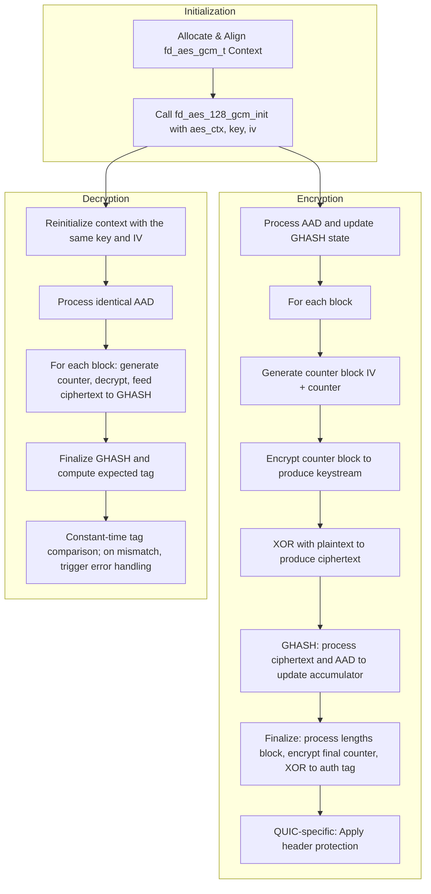
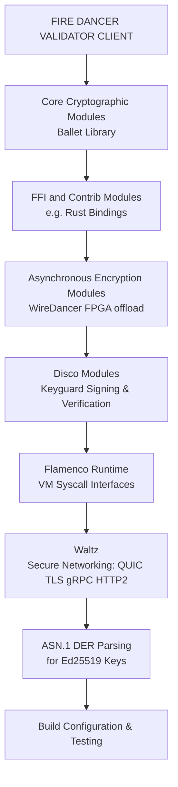

# Overview of Encryption in Firedancer

Firedancer’s validator client is built with encryption as a foundational element, securing both its internal runtime processes and external protocol exchanges. Deeply integrated throughout the system—from the cryptographic primitives (such as AES-GCM, ChaCha20, and digital signature schemes like Ed25519) to protocol-level protections involving TLS/QUIC, gRPC, and HTTP/2—this layered approach not only meets modern security standards but also reinforces a robust defense-in-depth strategy. Even if an attacker bypasses one layer, multiple safeguards remain active.

Key components of Firedancer’s encryption architecture include:

- Cryptographic primitives and libraries for authenticated encryption and digital signatures
- Secure random number generation supplying high-entropy keys and nonces
- Rigorously implemented key management and memory protection strategies
- Integrated protocol stack security via QUIC/TLS, HTTP/2, and gRPC encryption
- Performance optimizations through hardware acceleration and constant-time operations

# AES Encryption

Firedancer leverages AES encryption to deliver both robust security and high performance. By combining portable C implementations with hardware-accelerated backends (such as AES-NI, AVX, VAES, etc.), AES—used in modes like ECB and GCM—enables efficient encryption for data storage and protocol processing (for example, QUIC packet handling). Dynamic selection between reference and optimized routines provides a seamless balance between portability and speed.

Major usage hotspots include:

- Core cryptographic operations in the ballet module (AES-ECB and AES-GCM)
- Protection and processing for QUIC protocol packets and headers
- Hardware acceleration integration via AES-NI, AVX/VAES, and other SIMD extensions
- Optimized key expansion and modular backend selection based on target CPU features
- Secure validation in dedicated testing and sandbox environments

## Supported AES Modes

- **AES-ECB** — Provides baseline block encryption used as a primitive for advanced operations (APIs and constants in `fd_aes_base.h`; implementations in `fd_aes_base_ref.c` and `fd_aes_base_aesni.S`).
- **AES-GCM** — Delivers authenticated encryption by combining AES-CTR keystream generation with Galois field authentication (mode constants like `FD_AES_GCM_IV_SZ` and `FD_AES_GCM_TAG_SZ` defined in `fd_aes_gcm.h`; implementations in `fd_aes_gcm_ref.c`, `fd_aes_gcm_aesni.S`, and related files).

## AES Implementation Structure

The AES module’s layered design separates a portable reference C implementation from hardware-specific optimized backends. This facilitates both maintainability and performance across a range of CPUs.

### Reference

- **Portable C Implementation:**
    - Core AES routines (key expansion, encryption, decryption) are implemented in `firedancer/src/ballet/aes/fd_aes_base_ref.c`.
    - AES-GCM functionality is provided by `firedancer/src/ballet/aes/fd_aes_gcm_ref.c` and its header `fd_aes_gcm_ref.h`, performing initialization, Galois field multiplication, and finalization inspired by OpenSSL’s designs.
- **Design Considerations:**
    - Helper routines for finite field multiplication, byte-level transformations, and key scheduling ensure reliable and verifiable cryptographic operations.
    - Macros and function abstractions enable seamless replacement with accelerated backends when the target hardware supports them.

### SIMD/ASM Backends

- **AES-NI Optimized Implementation:**
    - Assembly routines in `firedancer/src/ballet/aes/fd_aes_base_aesni.S` and `firedancer/src/ballet/aes/fd_aes_gcm_aesni.S` directly leverage Intel’s AES-NI instructions (e.g., `AESENC`, `AESENCLAST`, `PCLMULQDQ`) for accelerated encryption and decryption.
- **AVX2, AVX10, and AVX-512 Backends:**
    - Advanced optimizations appear in `firedancer/src/ballet/aes/fd_aes_gcm_x86.c` and `firedancer/src/ballet/aes/fd_aes_gcm_avx10.S`, exploiting SIMD instructions (such as VAES and VPCLMULQDQ) to process multiple blocks concurrently.
    - Extensive macro-based code generation supports various vector widths (YMM or ZMM registers) and streamlines complex operations like GHASH precomputation and updates.

### Runtime Selection

- **Compile-Time Macros:**
    - Build configuration files (e.g., `firedancer/src/ballet/aes/Local.mk`; machine-specific files like `firedancer/config/machine/linux_gcc_icelake.mk`) define macros such as `FD_HAS_AESNI`, `FD_HAS_AVX`, `FD_HAS_GFNI`, and `FD_HAS_AVX512` to selectively compile the appropriate modules.
- **Runtime CPUID Checks:**
    - Logic in test files like `firedancer/src/ballet/aes/test_aes.c` executes CPUID checks to detect supported instruction sets. Based on the detected features, the system selects the fastest available acceleration path (e.g., favoring AVX2 or AVX-512) over the portable reference implementation.

This structured approach ensures AES encryption operations are optimized for the underlying hardware while maintaining reliability and compatibility.

## AES Key Management

Firedancer uses distinct key schedules for encryption and decryption, with separate routines for key expansion to guarantee secure operations both in software and hardware-accelerated modes. Below are key structure definitions from both the reference and AES-NI accelerated implementations:

```
/* Reference Implementation Key Structure */
typedef struct {
    uint32_t rounds;       // Number of AES rounds (e.g., 10 for AES-128, 12 for AES-192, 14 for AES-256)
    uint32_t rd_key[44];   // Expanded round keys (sized for the worst-case key expansion scenario)
} fd_aes_key_t;

/* AES-NI Accelerated Implementation Key Structure */
typedef struct {
    __m128i key_enc[11];   // Encryption key schedule for AES-128 stored in SIMD registers
    __m128i key_dec[11];   // Decryption key schedule, derived by transforming the encryption keys in reverse order
} fd_aes_gcm_aesni_key_t;
```

The key management process is as follows:

1. **Key Expansion:**
    - The AES module expands the provided key (typically 128 bits) into a full round key schedule.
    - The reference implementation uses helper functions (e.g., RotWord, SubWord, XtimeWord) to build the key schedule.
    - The AES-NI path leverages SIMD intrinsics like _mm_aeskeygenassist_si128 and _mm_aesimc_si128 for optimal expansion.
2. **Field: rounds (in fd_aes_key_t):**
    - Indicates the number of rounds (e.g., 10 rounds for AES-128), determined by the key length.
3. **Field: rd_key (in fd_aes_key_t):**
    - Stores the expanded key schedule for use in encryption and decryption.
4. **Field: key_enc (in fd_aes_gcm_aesni_key_t):**
    - Holds the encryption schedule computed via hardware-accelerated routines, with consecutive memory layout.
5. **Field: key_dec (in fd_aes_gcm_aesni_key_t):**
    - Contains the decryption key schedule, calculated by inverting and transforming the encryption schedule.
6. **Unified API Functions:**
    - High-level functions such as fd_aes_set_encrypt_key and fd_aes_set_decrypt_key abstract the underlying implementation details, delegating to either the reference routines or AES-NI variants.
    - Additional functions integrate key management into complete ECB operations and support specialized protocols like QUIC.

## AES-GCM Authenticated Encryption Flow

Firedancer’s AES-GCM implementation spans from pure C routines to optimized x86 assembly, and it is used both for general encryption/decryption tasks and specialized protocol functions (such as QUIC packet integrity). The following details the AES-GCM flow:

### Initialization

1. Load a 16-byte secret key and a 12-byte IV.
2. Expand the key into round keys using AES key schedule routines (e.g., `fd_aes_128_gcm_init_ref` in `fd_aes_gcm_ref.c`).
3. Compute the GHASH subkey by encrypting a zero block then precompute a lookup table (via `fd_gcm_init_4bit`).
4. For hardware-accelerated variants (e.g., in `fd_aes_gcm_aesni.S`), specialized functions (like `fd_aes_128_gcm_init_aesni`) perform parallel key expansion and GHASH precomputation.
5. Initialize context memory with proper alignment (typically 64 bytes).
6. (QUIC-specific) Derive keys and IVs using token-specific identifiers or HKDF.

```
fd_aes_gcm_t aes_ctx;
fd_aes_128_gcm_init(&aes_ctx, key, iv);
```

### Encryption Process: Buffer Handling and Tag Generation

1. **Process Additional Authenticated Data (AAD):**
    - Incorporate AAD into the GHASH state.
2. **Encrypt the Plaintext Buffer:**
    - Divide the plaintext into 16-byte blocks, generate a counter block (IV plus counter), encrypt it for the keystream, and XOR with plaintext.
    - Optimized backends can do these operations in parallel.
3. **Compute GHASH for Authentication:**
    - Update a 128-bit accumulator with GHASH multiplications over ciphertext and AAD.
4. **Finalize the Authentication Tag:**
    - Process any partial block and encode AAD/ciphertext lengths.
    - Encrypt a counter block (often with counter 1) and XOR with the accumulator to yield a 16-byte tag.
5. **API-Level Encryption:**
    - The function call encapsulates all steps:`void fd_aes_gcm_encrypt(fd_aes_gcm_t *aes_gcm, uchar *c, uchar const *p, ulong sz, uchar const *aad, ulong aad_sz, uchar tag[16]);`
6. **(QUIC-specific) Additional Steps:**
    - After encryption, QUIC routines mask header fields using a separately generated mask.

### Decryption Process: Tag Verification and Error Handling

1. Reinitialize the AES-GCM context with the same key and IV.
2. Process the identical AAD into the GHASH state.
3. Decrypt each ciphertext block by generating corresponding keystream blocks and XORing.
4. Recompute the expected tag by processing any residual blocks and lengths.
5. Perform a constant-time comparison of the computed tag with the transmitted tag; any mismatch triggers an error.
6. (QUIC-specific) Mismatches in retry token integrity produce immediate decryption failure.

```
fd_aes_128_gcm_init(&aes_ctx, key, iv);
if (fd_aes_gcm_decrypt(&aes_ctx, ciphertext, plaintext, plaintext_len, aad, aad_len, tag) != FD_AES_GCM_DECRYPT_OK) {
   // Handle decryption failure
}
```

### Overall Control Flow and Example Call Sequence

1. **Context Initialization:**
    - Allocate and align an AES-GCM context, then call the initialization function with the chosen key and IV.
2. **Encryption Flow:**
    - Process AAD to update GHASH.
    - For each block, derive a counter block, encrypt it, and XOR with plaintext to produce ciphertext.
    - Finalize GHASH and produce the authentication tag.
    - (QUIC-specific) Apply header protection afterward.
3. **Decryption Flow:**
    - Reinitialize context with the same key/IV.
    - Process the AAD.
    - Decrypt each block, compute the authentication tag, and verify integrity.
    - Handle authentication failures immediately.




## Core AES Logic

At the heart of the AES implementation is the classical round sequence: SubBytes, ShiftRows, MixColumns, and AddRoundKey. The Firedancer client provides both a portable C reference version and an AES-NI optimized assembly version. The reference implementation carefully applies bit-slice techniques and loop unrolling to emulate the standard transformations without relying on lookup tables. In contrast, the AES-NI version leverages hardware instructions (e.g., AESENC and AESENCLAST) to combine steps into fewer high-performance instructions.

Below is a representative round function from the reference implementation that encapsulates classical AES round processing:

```
/* Representative AES encryption round function */
static inline void aes_round(uint8_t state[16], const uint8_t roundKey[16]) {
    /*
     * SubBytes:
     * Performs a nonlinear substitution per byte using a fixed S-box.
     */
    SubBytes(state);

    /*
     * ShiftRows:
     * Performs a cyclic row-based permutation across the state matrix.
     */
    ShiftRows(state);

    /*
     * MixColumns:
     * Applies finite-field arithmetic to mix each column of the state.
     * (Note: This step is omitted in the final round.)
     */
    MixColumns(state);

    /*
     * AddRoundKey:
     * Combines the current state with a round-specific key using bitwise XOR.
     */
    for (int i = 0; i < 16; i++) {
        state[i] ^= roundKey[i];
    }
}
```

This illustration highlights both the step-by-step transformation and the techniques (such as bit-slicing and manual loop unrolling) used to deliver performance without sacrificing security.

## Hardware Optimizations

The Firedancer validator client employs several fine-tuned hardware optimizations by selecting architecture-specific paths at compile time. This methodology ensures that encryption operations extract maximum throughput from modern CPU architectures while maintaining flexibility for future updates.

| Optimization | Arch | Compile Flag(s) | Cycles/Byte |
| --- | --- | --- | --- |
| AES / AES-GCM | SSE (XMM), AVX2 (YMM), AVX‑512 | FD_HAS_AESNI (+ FD_HAS_AVX, FD_HAS_AVX512) | N/A |
| ChaCha20 | SSE (128‑bit / XMM), AVX (256‑bit / YMM) | FD_HAS_AVX (conditional selection) | N/A |
| SHA‑256 | AVX, AVX‑512 | FD_HAS_AVX, FD_HAS_AVX512 | N/A |
| SHA‑512 / SHA‑384 | AVX2, AVX‑512 | FD_HAS_AVX, FD_HAS_AVX512 | N/A |
| Reed–Solomon Error Correction | AVX2 (lookup tables), GFNI (with AVX2/AVX‑512) | FD_HAS_GFNI, FD_REEDSOL_ARITH_IMPL | N/A |
| Base58 Encoding | AVX2 | (Implicit via aligned routines) | ~30 cycles/64 ops |
| Big Integer & Montgomery Multiplication | x86 (128‑bit and intrinsic‑based) | FD_HAS_INT128 | N/A |
| BLAKE3 Hashing | SSE2, AVX2, SSE4.1, AVX‑512 | Dynamic dispatch (runtime selection) | N/A |
| ED25519 Finite Field/Curve Operations | AVX‑512 (6‑limb, radix‑2^43) | FD_HAS_AVX512 | N/A |
| Networking & Disco Modules | SSE, AVX | FD_HAS_SSE, FD_HAS_AVX (conditionally included) | N/A |
| Double‑Buffer Module | SSE | FD_HAS_SSE | N/A |

Notable assembly routines and optimized code paths include:

- **AES / AES-GCM:**
    - Assembly files such as `fd_aes_base_aesni.S` and `fd_aes_gcm_aesni.S` implement dedicated AES instructions (AESENC, AESDEC, AESENCLAST) and manage key scheduling and counter block processing.
- **ChaCha20:**
    - SSE optimizations in `fd_chacha20_sse.c` use 128-bit XMM intrinsics (e.g. _mm_shuffle_epi8).
    - AVX implementations in `fd_chacha20_avx.c` process multiple 32-bit words simultaneously through 256-bit registers.
- **SHA-256/SHA-512:**
    - Batch routines (e.g., `fd_sha256_batch_avx.c`, `fd_sha512_batch_avx512.c`) accelerate multiple message digest computations.
- **Reed–Solomon Error Correction:**
    - Accelerated Galois field arithmetic via GFNI in `fd_reedsol_arith_gfni.h` and an alternate AVX2 path in `fd_reedsol_arith_avx2.h`.
- **Base58 Encoding:**
    - Optimized routines in `fd_base58_avx.h` employ AVX2 intrinsics (_mm256_load_si256, _mm256_shuffle_epi8) for rapid conversion.
- **Big Integer / Montgomery Multiplication:**
    - Techniques in `fd_uint256_mul.h` exploit x86 intrinsics (e.g., _subborrow_u64) and native 128-bit arithmetic.
- **BLAKE3 Hashing:**
    - Multiple SIMD implementations (SSE2, AVX2, SSE4.1, AVX-512) are managed by dynamic dispatch in `blake3_dispatch.c`.
- **ED25519 Arithmetic:**
    - The “fd_r43x6” modules target 512-bit registers with AVX‑512’s madd52 instructions for accelerated multiplications.
- **Double-Buffer Module:**
    - In `fd_dbl_buf.c`, routine `fd_dbl_buf_insert` leverages SSE intrinsics (e.g. _mm_store_si128) with memory fences for atomic updates.

This careful selection and integration of SIMD instructions ensure maximum performance while maintaining security across diverse hardware.

## Testing and Validation

Robust testing is critical to ensuring that every encryption component in Firedancer performs correctly. The framework is organized into three primary categories:

- **Vectors**
    - Cryptographic test vectors validate primitive operations and protocol message handling:
        - SHA families: files such as `test_sha256.c`, `SHA256ShortMsg.rsp`, `SHA256Monte.rsp`
        - Signature schemes: `test_ed25519.c`, `test_ed25519_wycheproof.c`
        - Additional primitives: `test_chacha20.c`, `test_hmac.c`, `test_reedsol*`, `test_base58.c`, `fd_blake3_test_vector.c`, `test_bn254.c`, `test_poseidon.c`
        - TLS and protocol validation: `test_tls.c` and fixture files like `client_hello_labs-1.14.8.bin`, `server_hello_openssl.bin`
- **Fuzzing**
    - Fuzz tests exercise encryption routines with both randomized and adversarial inputs:
        - General cryptographic fuzzing: `fuzz_sha256.c`, `fuzz_sha384.c`, `fuzz_siphash13.c`, `fuzz_base58_garbage.c`, `fuzz_base58_roundtrip.c`
        - Module-specific targets: `fuzz_toml.c`, `fuzz_ed25519_sigverify.c`, `fuzz_quic.c`, `fuzz_quic_wire.c`, `fuzz_snapshot_http.c`
        - TLS-specific fuzzing: `fuzz_tls.c`
        - Integration with AFL++, libFuzzer, and Honggfuzz via specific Makefiles and scripts
- **CI Checks**
    - Continuous Integration ensures each commit undergoes extensive unit and integration testing:
        - Module-specific Makefiles (e.g., Local.mk) invoke test suites automatically
        - GitHub Actions workflows (e.g., tests.yml, clusterfuzz.yml) trigger a matrix build across various platforms
        - Dedicated test scripts (run_unit_tests.sh, run_integration_tests.sh) and coverage reports further validate encryption functions

Together, these testing strategies maintain high security, correctness, and performance across all encryption modules.

# ChaCha20 Encryption

In addition to AES-based solutions, Firedancer employs ChaCha20 encryption as a high-performance alternative that is particularly effective on platforms without dedicated AES hardware support. The ChaCha20 implementation serves multiple roles—including secure random number generation (RNG) and as a fallback for leader scheduling and data sharding—while meeting IETF RFC 7539 standards with a 256‑bit key and 128‑bit nonce configuration operating over 20 rounds.

Although AES remains widely used, ChaCha20 offers notable efficiency gains in software environments, especially on non‑AES accelerated platforms.

## Purpose and Use Cases

- **Fallback Paths** — Provides a secure alternate mechanism when AES acceleration is unavailable, ensuring consistent cryptographic performance.
- **ChaCha20‑based RNG** — Powers random number generation modules with deterministic seeding and secure, SIMD-optimized refill methods.
- **Leader and Weighted Sampling** — Enables secure derivation of leader schedules and stake-weighted sampling using ChaCha20 randomness.
- **Shred Destination and Shredder Components** — Supplies deterministic nonces and random indices for secure data sharding and integrity verification.
- **QUIC Cryptographic Suite Integration** — Serves as an alternative encryption primitive ensuring flexible security in AES-limited environments.

## Implementation Structure

Below is an indented directory tree illustrating the layout of the Firedancer encryption implementation, followed by numbered architectural notes.

```
Firedancer/
├── core/
│   ├── ballet/                // Primary cryptographic routines and primitives
│   │   ├── fd_sha256.c        // SHA‑256 implementation
│   │   ├── fd_sha512.c        // SHA‑512 implementation
│   │   ├── fd_aes_base_ref.c  // Reference AES (including AES‑GCM)
│   │   ├── fd_chacha20.c      // ChaCha20 stream cipher routines
│   │   ├── fd_curve25519.c    // Elliptic curve routines (ED25519, Curve25519, etc.)
│   │   ├── fd_reedsol*.c      // Reed‑Solomon error correction modules
│   │   └── fd_bmtree.c        // Merkle tree construction
│   ├── flamenco/              // Transaction processing and protocol state
│   │   └── fd_flamenco_txn_decode_footprint.c
│   ├── disco/                 // Networking including QUIC/TLS integrations
│   │   ├── fd_quic_crypto_suites.c
│   │   ├── fd_quic_retry.c    // QUIC Retry processing
│   │   └── fd_quic_conn.h     // Connection and key management integration
│   └── wiredancer/            // Low‑level hardware interaction
│       └── …
├── util/
│   └── simd/                  // SIMD helper routines and intrinsics
│       ├── SSE/
│       │   ├── fd_sse_vb.h
│       │   └── …
│       ├── AVX/
│       │   ├── fd_avx_wb.h
│       │   └── …
│       └── AVX512/
│           ├── fd_avx512_wwl.h
│           └── …
├── contrib/                 // External bindings (e.g. Rust FFI)
└── config/                  // Platform-specific build configurations
```

Numbered Notes:

1. **C Core Implementation:**
    - Implements fundamental cryptographic primitives (hashes, ciphers, digital signatures).
    - Supports both incremental and batch processing.
    - Provides block and stream cipher operations (AES‑GCM and ChaCha20) alongside secure RNG.
2. **SIMD Helpers (SSE/AVX/AVX‑512):**
    - Leverage native 128‑bit, 256‑bit, and 512‑bit intrinsics for acceleration.
    - Specialized routines for matrix transposition, block ciphers, and batched hashes.
3. **File Layout and Build Integration:**
    - The directory structure modularizes core cryptography from higher-level protocol handling.
    - Conditional compilation via Local.mk and machine-specific Makefiles ensures dynamic selection of optimized routines.
    - Unit and fuzz testing confirm integration integrity.

## Data Structures

The following structure is central to the ChaCha20‑based RNG used in Firedancer:

```
typedef struct {
    // 32-byte encryption key (32-byte aligned)
    uint8_t   key[32];

    // Buffer storing ChaCha20 block outputs (typically 64 bytes)
    uint32_t  buf[16];

    // Offset within the buffer indicating the next byte to read
    uint32_t  buf_off;

    // Counter representing total bytes generated (used for nonce generation)
    uint64_t  buf_fill;
} fd_chacha20rng_t;
```

| Field | Bytes | Meaning |
| --- | --- | --- |
| key | 32 | The 32-byte key used to seed ChaCha20; must be 32-byte aligned. |
| buf | 64 | A ring buffer holding ChaCha20 output (16 words × 4 bytes). |
| buf_off | 4 | Current offset in the buffer for the next random byte. |
| buf_fill | 8 | Total bytes generated; used to construct a unique nonce during each refill. |

This design guarantees that the RNG’s key remains constant, while the dynamically derived nonce (from buf_fill) and efficient buffer management ensure secure, pseudorandom output for high-performance applications.

## Encryption/Decryption Flow

Firedancer integrates low-level cipher operations with high-level protocol flows (QUIC, TLS) to encrypt both data and packets. The following outlines the overall flow:

### Ordered List of Steps

1. **Initialization and Key Expansion:**
    - Generate a key schedule from the base key; for QUIC, derive initial secrets via HKDF.
2. **AES Encryption/Decryption Flow:**
    - **Block Initialization:**
        - Load plaintext and XOR with the initial round key.
    - **Round Processing:**
        - Execute the appropriate number of AES rounds (10/12/14 rounds depending on key size).
        - In AES-GCM, also process AAD and compute GHASH for integrity.
    - **Hardware Acceleration:**
        - Utilize AES-NI and AVX assembly routines for processing 16-byte blocks concurrently.
3. **ChaCha20 Encryption/Decryption Flow:**
    - **State Construction:**
        - Initialize a 4×4 state matrix with fixed constants, key, block index, and nonce.
    - **Quarter Round Processing:**
        - Execute quarter-round operations using addition, XOR, and left rotations.
    - **Round Iterations:**
        - Run 20 rounds (10 iterations of one column and one diagonal round).
    - **SIMD Optimization:**
        - Leverage SSE/AVX instructions for parallel quarter-round processing.
4. **Integration with QUIC Protocol:**
    - **Packet Encryption:**
        - Encrypt payloads using AES-GCM and protect headers via AES-ECB masking.
        - Combine IV, packet number, and header sample into a unique nonce.
    - **Decryption Process:**
        - Inverse operations: decrypt payload, unmask header, and verify authentication tag.
5. **Parallelization and Validation:**
    - Multi-threading and SIMD-based routines enhance throughput, with extensive testing ensuring both security and performance.

### Pseudo-Code Snippet

```
function encrypt_packet(plain_packet, key, iv, aad):
    // Step 1: Key Expansion & Setup
    expanded_keys = key_expansion(key)
    nonce = generate_nonce(iv, plain_packet.packet_number)

    // Step 2: AES-GCM Encryption
    state = load_block(plain_packet.payload)
    state = state XOR expanded_keys[0]  // Initial round
    for round in 1 to total_rounds(expanded_keys):
        state = aes_round_transform(state, expanded_keys[round])
    auth_tag = ghash(aad, state)

    // Step 3: Header Protection
    header_mask = aes_ecb_mask(plain_packet.header_sample, key)
    protected_header = plain_packet.header XOR header_mask

    // Step 4: Assemble Encrypted Packet
    encrypted_packet = assemble_packet(protected_header, state, auth_tag)
    return encrypted_packet

function decrypt_packet(encrypted_packet, key, iv, aad):
    // Inverse operations: key expansion, nonce regeneration, decryption, and auth tag verification.
```

This pseudo-code captures key stages: key expansion, nonce generation, block encryption with GHASH computation, header masking/unmasking, and integration into QUIC protocol flows.

# Public API and Integration

Firedancer exposes a suite of public APIs that abstract away low-level cryptographic details while seamlessly integrating with higher-level modules. These interfaces encapsulate the functionalities for AES (both ECB and GCM) and ChaCha20, exposing them to components ranging from secure networking to key management and external FFI bindings.

Below is a schematic overview of the primary modules and their interactions:



This design not only promotes code reuse and maintainability but also simplifies integration testing, hardware acceleration, and multi-language support—ensuring Firedancer meets the strict security and performance requirements of the Solana ecosystem.

## API Functions

Below is an aggregated overview of the core cryptographic API functions in Firedancer. The table summarizes each function’s prototype, purpose, and corresponding source files.

| Function | Prototype | Purpose | File(s) |
| --- | --- | --- | --- |
| fd_aes_init | `void fd_aes_init(fd_aes_context_t *ctx, const uint8_t *key, size_t key_length);` | Initializes an AES context and generates a key schedule. | fd_aes_base.h, fd_aes_base_ref.c |
| fd_aes_set_encrypt_key | `void fd_aes_set_encrypt_key(const unsigned char *user_key, unsigned long bits, fd_aes_key_t *key);` | Prepares the AES encryption key schedule for block operations. | fd_aes_base.h, fd_aes_base_ref.c |
| fd_aes_set_decrypt_key | `void fd_aes_set_decrypt_key(const unsigned char *user_key, unsigned long bits, fd_aes_key_t *key);` | Prepares the AES decryption key schedule. | fd_aes_base.h, fd_aes_base_ref.c |
| fd_aes_encrypt | `void fd_aes_encrypt(const unsigned char *in, unsigned char *out, fd_aes_key_t *key);` | Encrypts a single plaintext block using AES. | fd_aes_base.h |
| fd_aes_decrypt | `void fd_aes_decrypt(const unsigned char *in, unsigned char *out, fd_aes_key_t *key);` | Decrypts a single ciphertext block using AES. | fd_aes_base.h |
| fd_aes_gcm_init | `void fd_aes_gcm_init(fd_aes_gcm_context_t *ctx, const uint8_t *key, size_t key_len);` | Initializes an AES‑GCM context for authenticated encryption/decryption. | fd_aes_gcm_ref.h, fd_aes_gcm_ref.c |
| fd_aes_gcm_encrypt | `int fd_aes_gcm_encrypt(fd_aes_gcm_context_t *ctx, const uint8_t *iv, size_t iv_len, const uint8_t *aad, size_t aad_len, const uint8_t *plaintext, uint8_t *ciphertext, size_t text_len, uint8_t *tag, size_t tag_len);` | Performs AES‑GCM authenticated encryption ensuring data confidentiality and integrity. | fd_aes_gcm_ref.h, fd_aes_gcm_ref.c |
| fd_aes_gcm_decrypt | `int fd_aes_gcm_decrypt(fd_aes_gcm_context_t *ctx, const uint8_t *iv, size_t iv_len, const uint8_t *aad, size_t aad_len, const uint8_t *ciphertext, uint8_t *plaintext, size_t text_len, const uint8_t *tag, size_t tag_len);` | Performs AES‑GCM authenticated decryption with tag verification. | fd_aes_gcm_ref.h, fd_aes_gcm_ref.c |
| fd_chacha20_block | `void *fd_chacha20_block(void *block, const void *key, const void *idx_nonce);` | Generates a 64‑byte pseudo‑random output block using ChaCha20. | fd_chacha20.h, fd_chacha20.c, fd_chacha20_sse.c, fd_chacha20_avx.c |
| fd_chacha20_quarter_round | `static inline void fd_chacha20_quarter_round(uint *a, uint *b, uint *c, uint *d);` | Internal helper performing the ChaCha20 quarter round operation. | fd_chacha20.h (internal) |

### Example – AES Base API

```
#include "fd_aes_base.h"

int main(void) {
    unsigned char key_data[16] = { /* 16-byte AES-128 key */ };
    unsigned char plaintext[16] = { /* data to encrypt */ };
    unsigned char ciphertext[16];
    unsigned char decrypted[16];
    fd_aes_key_t key;

    // Set up the AES encryption key schedule
    fd_aes_set_encrypt_key(key_data, 128UL, &key);

    // Encrypt the plaintext block
    fd_aes_encrypt(plaintext, ciphertext, &key);

    // Reinitialize the key schedule for decryption
    fd_aes_set_decrypt_key(key_data, 128UL, &key);

    // Decrypt the ciphertext block
    fd_aes_decrypt(ciphertext, decrypted, &key);

    return 0;
}
```

### Example – AES‑GCM API

```
#include "fd_aes_gcm_ref.h"

int main(void) {
    fd_aes_gcm_context_t gcm_ctx;
    uint8_t key[16] = { /* 16-byte AES key */ };
    uint8_t iv[12]  = { /* 12-byte IV */ };

    // Initialize the AES-GCM context with the key
    fd_aes_gcm_init(&gcm_ctx, key, sizeof(key));

    uint8_t aad[] = { /* Additional Authenticated Data */ };
    uint8_t plaintext[] = { /* plaintext data */ };
    size_t text_len = sizeof(plaintext);
    uint8_t ciphertext[text_len];
    uint8_t tag[16];

    if (fd_aes_gcm_encrypt(&gcm_ctx, iv, sizeof(iv),
                           aad, sizeof(aad),
                           plaintext, ciphertext, text_len,
                           tag, sizeof(tag)) != 0) {
        // Handle encryption error
    }

    // For decryption, initialize the context similarly and call fd_aes_gcm_decrypt().
    return 0;
}
```

### Example – ChaCha20 API

```
#include "fd_chacha20.h"
#include <stdint.h>
#include <string.h>

int main(void) {
    uint32_t block[16] __attribute__((aligned(64)));      // 64-byte output block
    uint32_t key[8]   __attribute__((aligned(32)));         // 32-byte key
    uint32_t idx_nonce[4] __attribute__((aligned(16)));     // 16-byte nonce and block index

    // Initialize key and idx_nonce (e.g., via memcpy from secure storage)
    // memcpy(key, your_key_data, sizeof(key));
    // memcpy(idx_nonce, your_nonce_data, sizeof(idx_nonce));

    // Generate one ChaCha20 output block
    void *result = fd_chacha20_block(block, key, idx_nonce);
    return 0;
}
```

Together, these APIs expose the robust capabilities of AES and ChaCha20, enabling their integration into networking, key management, and higher-level security protocols within Firedancer.

## Integration Points in Firedancer

Below is an overview mapping key encryption-related subsystems to their integration points and associated APIs:

| Subsystem | Call Site | API Used |
| --- | --- | --- |
| Cryptographic Core – AES‑GCM | firedancer/src/ballet/aes (e.g., fd_aes_gcm_x86.c, fd_aes_gcm_aesni.S, fd_aes_gcm_ref.c) | fd_aes_128_gcm_init, fd_aes_gcm_encrypt, fd_aes_gcm_decrypt, GHASH routines |
| Cryptographic Core – ChaCha20 | firedancer/src/ballet/chacha20 (fd_chacha20.c, fd_chacha20_sse.c, fd_chacha20_avx.c) | Core ChaCha20 block functions and SIMD‑optimized variants |
| Networking – QUIC (Waltz) | firedancer/src/waltz/quic (fd_quic_retry.c, fd_quic_crypto_suites.c, fd_quic.c) | fd_quic_crypto_decrypt_hdr, fd_quic_crypto_encrypt, key derivation using AES‑GCM routines |
| Networking – TLS | firedancer/src/waltz/tls (fd_tls.c, fd_tls_estate.h) | fd_tls_server_handshake, fd_tls_client_handshake, fd_tls_hkdf_expand_label, TLS record encryption functions |
| Secure Key Management and Vote Signing | firedancer/src/disco/keyguard (fd_keyload.h/c, fd_keyguard_client.h/c) | Key loading interfaces, guarded memory access, and ED25519 signature routines |
| Cryptographic Randomness and Leader Scheduling | firedancer/src/flamenco/leaders (fd_leaders.c) and fd_rng_secure | fd_rng_secure, ChaCha20‑based RNG functions for secure leader election |
| Hardware Acceleration | Assembly and SIMD files (e.g., fd_aes_gcm_aesni.S, fd_aes_gcm_avx10.S, fd_chacha20_sse.c) | Hardware-optimized AES‑GCM and ChaCha20 routines leveraging AES‑NI, AVX, and AVX‑512 |
| Build, Test, and Development Tools Integration | firedancer/src/app/shared_dev/commands (e.g., fd_quic_trace_rx_tile.c, keys.c) and test suites | Encryption function tests, key management utilities, debugging, and tracing utilities |

### Narrative Overview

- The Cryptographic Core in the ballet module provides AES‑GCM and ChaCha20 encryption routines. Files such as `fd_aes_gcm_x86.c` select hardware-accelerated routines based on CPU capabilities, exposing unified APIs like `fd_aes_128_gcm_init`, `fd_aes_gcm_encrypt`, and `fd_aes_gcm_decrypt`.
- The ChaCha20 implementation in the ballet/chacha20 subdirectory offers both standard and SIMD-optimized operations, serving roles in general encryption as well as secure RNG.
- Networking modules (QUIC and TLS) in the Waltz directory use AES‑GCM for packet payload encryption and header protection, calling functions such as `fd_quic_crypto_encrypt` and `fd_quic_crypto_decrypt_hdr`.
- Keyguard modules in Disco handle secure key loading and vote signing, ensuring that private keys are managed securely while interfacing with ED25519 routines.
- Leader scheduling leverages ChaCha20‑based randomness (e.g., via `fd_rng_secure`) to produce cryptographically strong nonces essential for unbiased leader election.
- Dedicated assembly and SIMD-optimized files ensure that cryptographic operations are executed efficiently on modern CPUs.
- Integration with build and test systems, including unit tests and fuzzing frameworks, constantly validates that encryption routines perform securely and correctly.

# Testing & Validation Summary

- Automated build and test suites validate core encryption functions across multiple configurations (GCC, Clang, various CPU architectures) using unit tests, integration tests, and test vector comparisons.
- AES testing rigorously verifies key expansion and both ECB and GCM modes using reference vectors, boundary checks, hardware-accelerated implementations (AES-NI, AVX, GFNI), and integration within QUIC protocol workflows.
- ChaCha20 tests ensure compliance with RFC 7539, including both the block cipher and RNG components, accented by performance benchmarks and intensive repeat testing.
- Fuzz testing and continuous coverage reporting (via LLVM tools) integrated into CI workflows ensure resilience and security under diverse and adversarial conditions.

Future test plans include expanded fuzzing scenarios, regression tests covering emerging cryptographic edge cases, and sophisticated performance benchmarks to further validate encryption under real-world conditions. These efforts will continue to fortify the security, reliability, and performance of the Firedancer validator client.

# Glossary

**QUIC (Quick UDP Internet Connections)** — A UDP-based transport protocol enabling secure, low-latency communications; in Firedancer, it is used for connection handling, packet processing, and TLS-based encryption.

**FPGA (Field-Programmable Gate Array)** — Reconfigurable hardware used to accelerate cryptographic operations, such as ED25519 signature verification.

**RPC (Remote Procedure Call)** — A mechanism for inter-component communication; Firedancer leverages JSON-RPC for processing transaction and block data.

**gRPC** — A high-performance RPC framework used within Firedancer for asynchronous I/O and secure communications.

**HTTP/2** — A protocol employing multiplexing and header compression to optimize encrypted data transfer in Firedancer’s networking stack.

**TLS (Transport Layer Security)** — A cryptographic protocol providing secure communications; Firedancer implements TLS 1.3 to manage handshakes and secure data channels.

**eBPF (Extended Berkeley Packet Filter)** — A Linux kernel feature for running custom code to filter packets and monitor performance, enhancing security.

**XDP (Express Data Path)** — A high-performance network data path attached to devices, enabling rapid packet processing/filtering.

**FFI (Foreign Function Interface)** — An interface allowing interoperation between code written in different languages (e.g., linking Rust-based crypto with C modules).

**SSE, AVX, and AVX-512** — SIMD instruction sets used to accelerate cryptographic computations; optimized in modules handling AES, ChaCha20, and ED25519 arithmetic.

**AES (Advanced Encryption Standard) with AES-GCM** — A symmetric block cipher operating in Galois/Counter Mode that provides authenticated encryption with both data confidentiality and integrity.

**ChaCha20** — A stream cipher generating pseudorandom block sequences; its implementation includes optimized quarter-round functions using SSE and AVX.

**Poly1305** — A MAC algorithm that produces a 16-byte authenticator to ensure message integrity when paired with ChaCha20.

**AEAD (Authenticated Encryption with Associated Data)** — An encryption scheme that simultaneously provides confidentiality and authentication, as used in AES-GCM.

**Ed25519** — A high-performance digital signature algorithm based on Edwards curves (Curve25519); implemented with constant-time operations to mitigate side-channel risks.

**Curve25519 / X25519** — Elliptic curve algorithms for efficient key exchange; X25519 is used specifically for Diffie–Hellman key agreement.

**Ristretto255** — A prime-order group derived from Edwards25519 that simplifies point compression and hash-to-curve operations.

**secp256k1 and secp256r1** — Elliptic curves used in ECDSA; secp256k1 is notable in Bitcoin while secp256r1 is widely standardized for cryptographic operations.

**BN254 (alt_bn128)** — A pairing-friendly elliptic curve used in advanced cryptographic protocols like zero-knowledge proofs.

**Digital Signatures & Keypairs** — Mechanisms using asymmetric cryptography to validate transactions and ensure authenticity.

**SHA-1, SHA-256, and SHA-512** — Cryptographic hash functions producing 160-bit, 256-bit, and 512-bit digests, respectively.

**BLAKE3** — A fast, parallelizable hash function supporting both portable and SIMD-optimized implementations.

**Keccak-256 (SHA-3)** — A permutation-based hash function that outputs 256-bit digests, providing data integrity.

**SipHash-1-3** — A fast, keyed hash function designed for short inputs, used in one-shot authentication.

**HMAC (Hash-based Message Authentication Code)** — A construction using a hash function and secret key to produce a message authenticator; forms the basis for HKDF extract.

**HKDF (HMAC-based Key Derivation Function)** — A method to expand shared secrets into cryptographic keys, IVs, and header protection values.

**Finite Field (ℤₚ)** — A field defined over a prime number p (e.g., p = 2²⁵⁵–19 in Ed25519), used in elliptic curve arithmetic.

**Scalar Arithmetic** — Operations on fixed-size integers (often 32 bytes) used for elliptic curve point multiplication.

**Extended Coordinates** — A representation (X, Y, Z, T) of elliptic curve points enabling efficient point addition and doubling.

**modp_inv** — A function computing the inverse modulo p, essential in curve operations.

**Base58 and Base64** — Encoding schemes that translate binary data into human-readable text; Base58 is used for public key encoding.

**YAML and Protobuf** — Serialization formats for configuration and blockchain data.

**Merkle Trees** — Data structures that hierarchically aggregate node hashes to provide efficient proofs of inclusion.

**Pedersen Commitments** — Cryptographic commitments that bind data securely without revealing it.

**Test Vectors** — Predefined input/output sets used to verify cryptographic functions.

**Fuzz Testing** — Automated testing using randomized inputs (e.g. via libFuzzer) to detect vulnerabilities.

**Zero-Knowledge Proof (ZKP)** — Protocols that enable proving knowledge of a value without revealing it.

**Merlin Transcript** — A protocol for aggregating messages and producing challenges via the Fiat-Shamir heuristic.

**STROBE Protocol** — A protocol used to absorb data streams and generate pseudo-random outputs for secure transcript management.

**PCIe (Peripheral Component Interconnect Express)** — An interface for high-speed data transfers between host and devices (e.g., FPGAs).

**DMA (Direct Memory Access)** — A mechanism to transfer data without CPU intervention, critical to high-speed cryptographic processing.

**CDC (Clock Domain Crossing)** — Techniques for safely transferring data between different clock domains.

**FIFO Buffers** — Hardware queues that preserve order during data transfers.

**SLR (Super Logic Region)** — FPGA partitioning that optimizes timing for cryptographic pipelines.

**RTL Operation Codes** — Custom instructions used in pipelined FPGA-based cryptographic computations.

**ASN.1 (Abstract Syntax Notation One)** — A standard for defining data structures used in cross-platform communication.

**DER (Distinguished Encoding Rules)** — A binary encoding for ASN.1 ensuring a unique representation, essential for processing keys.

**RFC 8410** — The specification for Ed25519 key representation in ASN.1.

**fd_asn1_ed25519_pubkey_prefix** — A constant marking the start of an ASN.1 DER-encoded Ed25519 public key.

**fd_ed25519_public_key_from_asn1** — A function that extracts a 32-byte Ed25519 public key from a DER-encoded buffer.

**QUIC Encryption** — The encryption process in QUIC involves key derivation (via HKDF) and protection of both payloads and headers.

**TLS Handshakes** — Procedures for establishing a secure TLS connection through key exchange and handshake negotiation.

**X.509 vs. Raw Public Key (RPK)** — Standard versus minimal public key formats; Firedancer supports both as necessary.

**RNG (Random Number Generation)** — Secure mechanisms (e.g., fd_rng_secure) that produce nonces and key material for cryptographic operations.

**Precompiled Contracts** — Native functions embedded in the runtime to execute efficient cryptographic operations without full contract overhead.

**Syscalls (FD_VM_*)** — System calls exposing cryptographic primitives to the blockchain virtual machine while managing resource usage.

This glossary defines the core acronyms and terms used throughout the document, providing a concise reference for the technical details of Firedancer’s encryption architecture.

Made with ❤️ by [Driver](https://www.driver.ai/) in 25 minutes
