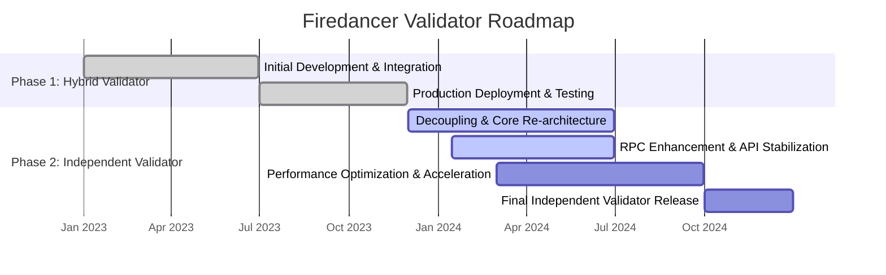
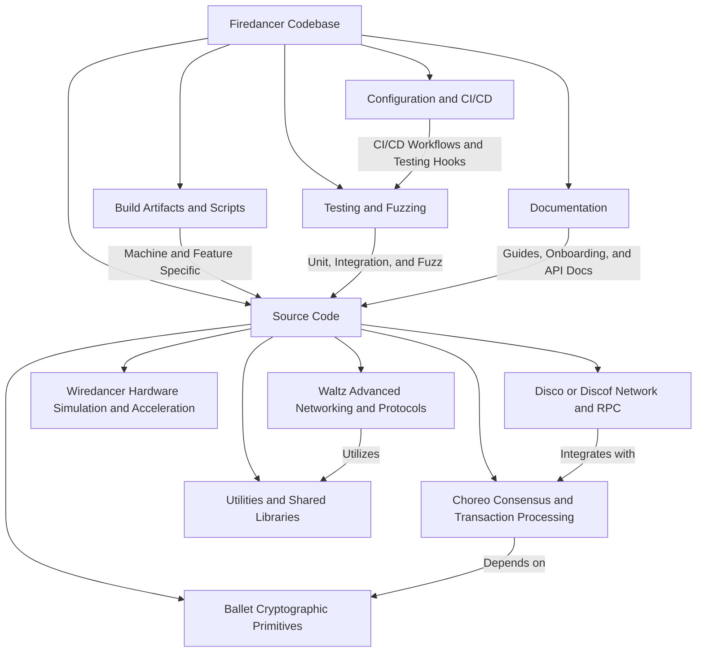
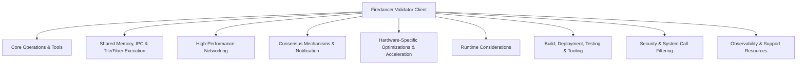
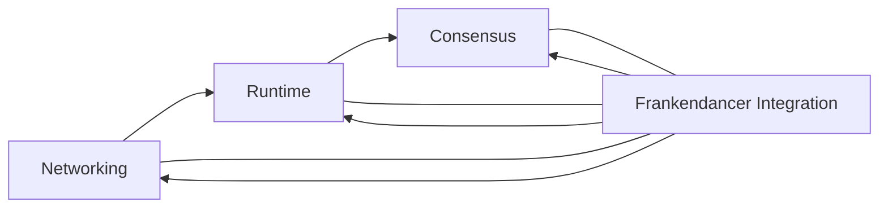
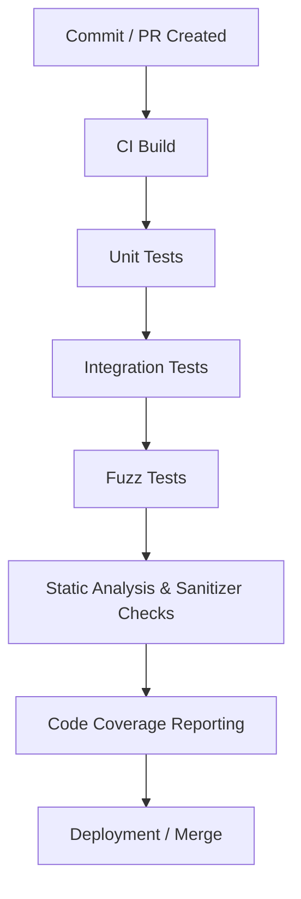

Firedancer Onboarding Guide
===========================

Introduction
============

Firedancer is a high-performance validator client for the Solana blockchain, built from the ground up in C to offer unparalleled speed, security, and efficiency. Engineered to overcome common performance bottlenecks, it leverages advanced cryptographic operations, innovative networking techniques, and custom hardware acceleration to ensure high throughput with robust error handling. Its well-organized codebase—featuring core modules in the "src" directory and comprehensive documentation in folders like "book" and "doc"—demonstrates a dual focus on raw performance and fortified security.

Jump Trading Group is the driving force behind Firedancer. Recognizing the need for diversified and resilient validator clients within the Solana ecosystem, they designed Firedancer as an alternative approach to Rust-based validators. Emphasizing low-latency trading systems, secure independent architectures (such as AVX512 ED25519 signature verification and a tightly controlled sandbox environment), and reduced supply chain risks, the project reflects a commitment to both immediate performance and future-proof scalability.

This onboarding guide is crafted as a technical companion to help you quickly navigate the Firedancer project. It covers the project's objectives, core architectural decisions, and detailed instructions for setting up the development environment, running tests, and configuring the system for optimal performance. Whether you are new to blockchain development or an experienced engineer, this guide will provide you with essential context and operational insights to contribute effectively to Firedancer’s evolution.

Business and Project Context
============================

Firedancer is a high-performance validator client developed for the Solana blockchain. It is engineered to deliver rapid transaction processing, strong security, and operational independence. Leveraging cutting-edge networking components, custom cryptographic optimizations, and a concurrent design inspired by low-latency trading systems, Firedancer not only satisfies the rigorous demands of high-throughput operations but also reinforces the overall robustness and scalability of Solana.

As a strategic initiative, Firedancer is designed as an independent, C-based alternative to traditional Rust-based validators. This independence minimizes external dependencies and supply chain risks, while its comprehensive documentation—covering everything from configuration and performance tuning to security best practices and community support—ensures that engineers can deploy and optimize the validator confidently.

Key documentation links and project objectives include:

* Comprehensive guides and reference materials housed in the firedancer/book repository, such as:
    
    * An overview of performance, security, and operational independence in Index.md.
        
    * Detailed guides on configuration, initialization, monitoring (with Agave CLI and Prometheus), troubleshooting, and performance tuning.
        
    * The Firedancer.md document outlining the project's mission, vision, and technical differentiators.
        
* Configuration and build resources including the config and contrib folders, GNUmakefile, deps.sh, and automated documentation tools available in the .vitepress folder.
    
* Dedicated security and operational documentation (SECURITY.md, LICENSE, NOTICE) alongside detailed setup instructions.
    
* Active community and support channels, such as the #firedancer channel on Solana Tech Discord, which encourage collaborative contributions and continuous improvement.
    

Firedancer Mission and Vision
-----------------------------

Firedancer is dedicated to delivering a high-performance validator client for the Solana network with a focus on maximized throughput, robust security, and diversified client deployment. At its core, the project employs optimized networking techniques that include custom cryptographic operations, efficient resource management, and a secure sandbox environment. This independent, ground-up implementation refines validator operations while mitigating risks associated with third-party dependencies.

The project’s innovations lower barriers for node operators by enhancing network resilience and fostering community-driven development. By advancing scalable network performance and integrating stringent security practices, Firedancer plays a pivotal role in strengthening the Solana ecosystem—ensuring it evolves in response to growing demands and emerging challenges.

Project Roadmap
---------------

Firedancer’s development roadmap charts a clear evolution—from the initial hybrid Frankendancer validator that blends legacy Agave components with new high-performance modules, to a fully independent validator built solely on Firedancer’s native architecture. In Phase 1, this hybrid approach is in production, leveraging transaction filtering pipelines, deep caching, and legacy integration to ensure stability and optimal performance. In Phase 2, the focus shifts to decoupling entirely from Agave, re-architecting core modules, refining RPC interfaces, and exploring hardware acceleration strategies, with the ultimate goal of delivering a standalone validator by the end of 2024.




Team Practices and Development Culture
======================================

The Firedancer project embraces an open-source contribution model, fostering collaboration between community members and internal teams. The project places a strong emphasis on rigorous code quality—using automated pre-commit hooks, detailed linting scripts, and comprehensive testing workflows—to ensure that every change aligns with established coding standards. Clear communication is maintained through dedicated channels such as Solana Tech Discord and well-structured documentation, while peer review workflows integrate automated checks with manual domain expert reviews for thorough quality assurance.

|     |     |     |
| --- | --- | --- |
| Practice | Description | Reference/Link |
| Open-Source Contribution Model | Encourages both community and internal contributions via pull requests addressing bugs, new features, or performance optimizations. Repository folders like .github, contrib, and book streamline engagement and enforce automated testing and validation. | CONTRIBUTING.md |
| Code Quality Expectations | Enforces strict coding practices through pre-commit hooks, linting scripts, and extensive testing workflows (including CodeQL analysis) to maintain consistency and detect potential issues early. | .pre-commit-config.yaml  <br>firedancer/contrib/lint.sh |
| Communication Practices | Maintains clear channels via automated feedback workflows, designated code ownership files, community spaces like the Solana Tech Discord (#firedancer), and detailed documentation to facilitate smooth collaboration. | CODEOWNERS  <br>[Solana Tech Discord](https://discord.com/invite/solana) |
| Peer Review Workflows | Integrates automated testing and detailed manual reviews, ensuring that each pull request is thoroughly scrutinized by domain experts before merging into the main branch. | .github/workflows/on_pull_request.yml |
| Contributing Guidelines & Resources | Provides extensive guidelines through CONTRIBUTING.md and additional material in the book and doc folders, aligning contributors with best practices from both the broader Solana and Agave ecosystems. | CONTRIBUTING.md  <br>Documentation Folder |

Firedancer’s culture is built on a foundation of open-source collaboration, strong quality controls, and transparent communication. This approach ensures that both internal teams and external contributors consistently maintain the high standards expected throughout the project.

Codebase Overview
=================

The Firedancer codebase is a modular, well-organized repository designed to support the high-performance validator client. It clearly separates concerns among directories for configuration, documentation, builds, source code, and testing. The repository includes specialized submodules that handle low-level cryptographic operations (Ballet), consensus protocols (Choreo), network management (Disco/Discof), hardware simulation (Wiredancer), and advanced networking (Waltz), ensuring maintainability, scalability, and continuous validation across system components.




Directory Structure and Layout
------------------------------

Below is a high-level visualization of the Firedancer repository structure followed by a table outlining the purpose and key components of each primary directory.

### Repository Tree Visualization

A simplified view of the top-level directory tree:

```
    firedancer/
    ├── .github         # Automated workflow configurations (CI/CD, GitHub Actions, etc.)
    ├── .vscode         # VS Code settings and debugging configurations
    ├── book            # Validator client documentation and guides (VitePress-based)
    ├── config          # Build settings, makefile configurations, and environment setups
    ├── contrib         # Supplemental tools and scripts (code generation, GDB helpers, etc.)
    ├── corpus          # Fuzz testing assets for discovering edge cases and vulnerabilities
    ├── doc             # Detailed documentation and technical discussions
    ├── src             # Core source code modules for blockchain operations and more
    │   ├── app         # Application-level logic (validators, RPC servers, ledger, etc.)
    │   ├── ballet      # Cryptographic operations and data integrity routines
    │   ├── choreo      # Consensus modules (epoch handling, fork management, voting, etc.)
    │   ├── disco       # Network operations, transaction filtering, and related processing
    │   ├── flamenco    # Solana-specific functionality (capture, genesis, gossip, snapshot)
    │   ├── funk        # High-performance database and shared memory operations
    │   ├── tango       # Command & control, caching, IPC, and timing operations
    │   └── util        # General utility libraries (memory, math, threading, etc.)
    └── (Additional files: .gitignore, LICENSE, README.md, etc.)
```

### Directory Overview Table

|     |     |     |
| --- | --- | --- |
| Directory | Purpose | Key Components |
| .github | Stores CI/CD and workflow configurations for automated testing and integration. | GitHub Actions workflows, Codecov settings, Dependabot configurations |
| .vscode | Contains VS Code-specific settings and debugging configurations. | launch.json for C++ debugging using GDB, various IDE-specific settings |
| book | Validator client documentation and guides aimed at users and developers. | VitePress configuration files, API documentation, validator guides |
| config | Manages build settings, Makefile configurations, and environment-specific setups. | Makefiles, compiler configurations, architecture-specific build scripts |
| contrib | Supplemental tools and scripts that support development, testing, and operations tasks. | Code generation scripts, GDB helper scripts, monitoring and debugging tools |
| corpus | Assets for fuzz testing designed to expose edge cases and vulnerabilities. | Fuzz test cases, module-specific inputs |
| doc | Comprehensive documentation on architecture, design decisions, and operational guides. | Organizational layouts (e.g., organization.txt), detailed technical discussions |
| src | Houses the core source code implementing validator operations and blockchain processes. | Subdirectories for app, ballet, choreo, disco, flamenco, funk, tango, and util components |
| Additional Files | Root-level configuration and documentation files. | .gitignore, LICENSE, README.md and other project-related documentation |

This structured layout simplifies navigation for new engineers and delineates documentation, configuration, testing, and source code components.

Developer Environment Setup
===========================

Setting up your local development environment for Firedancer involves a series of well-defined steps. Follow these 10 steps, along with troubleshooting tips, to ensure that your system is configured to build and test the validator client reliably.

1.  **Verify System Requirements**  
    Ensure your system meets these prerequisites:
    
    * Operating System: Linux (macOS and FreeBSD are supported via specific machine files).
        
    * Kernel: Linux kernel v4.18 or later.
        
    * Hardware: A 24–32 core CPU supporting 128-bit and atomic operations, SSE instructions, and 64–128 GB RAM.
        
    * Toolchain: A complete C/C++ toolchain (GCC or Clang), GNU Make, and a POSIX shell; additional tools include Git, Python 3, and common Unix utilities.
        
2.  **Clone the Core Firedancer Repository**  
    Clone the repository, including all submodules:
    
```
        git clone --recurse-submodules https://github.com/firedancer-io/firedancer.git
        cd firedancer
```
    
    Verify that key directories such as ".github", "config", and "src" are present.
    
3.  **(Optional) Clone Wiredancer Components on AWS-FPGA**  
    If working with Wiredancer, clone the AWS-FPGA repository on your EC2 build machine:
    
```
        git clone https://github.com/aws/aws-fpga
```
    
    Then copy the necessary files from:
    
```
        firedancer/wiredancer/platforms/f1/build
```
    
    into the corresponding directory in the AWS-FPGA repository.
    
4.  **Install Core Dependencies**  
    Fetch and build third-party libraries with:
    
```
        ./deps.sh
```
    
    To bundle dependencies into a redistributable package, run:
    
```
        ./contrib/deps-bundle.sh
```
    
5.  **Set Up Go Modules for QUIC Components**  
    For components written in Go, navigate to the compatibility directory and download required modules:
    
```
        cd firedancer/contrib/quic/go_compat
        go mod download
```
    
6.  **Initialize the Build System**  
    From the repository root, use the Makefile-based build system to compile the project:
    
```
        make
```
    
    For parallel builds, execute:
    
```
        make -j
```
    
7.  **Build Modules and Machine-Specific Configurations**  
    To build using a specific machine configuration (e.g., Linux with Clang on Haswell):
    
```
        make -f firedancer/config/machine/linux_clang_haswell.mk
```
    
    For individual modules (like the fddev application), change into its directory and run:
    
```
        cd src/app/fddev
        make
```
    
8.  **Run Setup Scripts for Development and Runtime Initialization**  
    Use the provided scripts to configure runtime settings:
    
    * Launch fddev:
        
```
            ./fddev
```
        
    * Configure runtime via fdctl:
        
```
            fdctl configure
```
        
        For advanced configuration with kernel tweaks:
        
```
            sudo ./build/native/gcc/bin/fdctl configure init all --config ~/config.toml
```
        
9.  **(Optional) Configure Wiredancer (WD) on AWS-FPGA**  
    For FPGA acceleration:
    
    * Load the WD image:
        
```
            sudo fpga-load-local-image -S 0 -I agfi-01051ff14d1bba4e0
```
        
    * Configure FD shared memory:
        
```
            sudo build/linux/gcc/x86_64/bin/fd_shmem_cfg reset
            sudo build/linux/gcc/x86_64/bin/fd_shmem_cfg fini
            sudo build/linux/gcc/x86_64/bin/fd_shmem_cfg alloc 32 gigantic 0  alloc 512 huge 0
            sudo build/linux/gcc/x86_64/bin/fd_shmem_cfg init 0700 $USER ""
            sudo build/linux/gcc/x86_64/bin/fd_shmem_cfg query
```
        
    * Initialize and run the Wiredancer demo:
        
```
            sudo ./build/linux/gcc/x86_64/bin/fd_frank_init_demo frank 1-6 ./build/linux/gcc/x86_64 /tmp/solana.pcap 0 0 1 0
            sudo ./build/linux/gcc/x86_64/bin/fd_frank_run frank "1-6"
```
        
    * Monitor performance:
        
```
            sudo taskset -c 7 build/linux/gcc/x86_64/bin/wd_frank_mon frank --duration 0
            sudo taskset -c 7 build/linux/gcc/x86_64/bin/fd_frank_mon frank --duration 10e12 --dt-min 1e7 --dt-max 1e7
```
        
10. **Set Up the Debugging Environment**  
    For interactive debugging using Visual Studio Code:
    
    * Open the repository in VS Code.
        
    * Ensure that ".vscode/launch.json" is properly configured (e.g., pointing to "${workspaceFolder}/build/native/gcc/bin/fddev").
        
    * Select the "fddev" debug configuration and start the debugging session.
        

### Troubleshooting Tips

* Verify your Linux kernel version (≥ v4.18) using `uname -r`.
    
* Ensure all submodules are properly cloned; if not, run `git submodule update --init --recursive`.
    
* If dependency scripts fail, confirm that Git, Python 3, and a proper C/C++ toolchain are installed.
    
* For AWS-FPGA or Wiredancer integration issues, ensure that the correct firmware image is loaded and that build scripts execute in the proper sequence.
    
* For build failures, review module-specific Local.mk and machine configuration Makefiles for required flags and dependency paths.
    
* When using VS Code for debugging, verify that paths in ".vscode/launch.json" match your local build output directories.
    

Following these steps will establish a robust and reproducible development environment for the Firedancer validator client.

Building, Running, and Configuring Firedancer
=============================================

This section describes how to build the project using Makefile-driven steps, initialize the validator processes, and configure key runtime parameters. It is organized into three sections: Build Process, Initialization, and Configuration.

Build System
------------

The Firedancer build system is modular, configurable, and automated to compile, test, and package the validator client. It employs GNU Makefiles, Cargo build scripts, and GitHub Actions workflows for reproducible builds across C, C++/ASM, and Rust. Conditional compilation flags, machine-specific configurations, and integrated code generation ensure that builds are robust and optimized.

```
    graph LR
        A[Start: Initiate Build Process] --> B[Module-specific Builds]
        B --> C[Conditional Compilation & Configuration]
        C --> D[Dependency Resolution & Code Generation]
        D --> E[Integration of Rust & Cargo Builds]
        E --> F[Continuous Integration via GitHub Actions]
        F --> G[Testing: Unit, Integration, Fuzz, Coverage]
        G --> H[Packaging & Artifact Generation]
```


|     |     |     |
| --- | --- | --- |
| Common Issue | Cause | Resolution |
| Incorrect or missing compile-time flags | Required environment variables or Makefile macros not properly set | Verify and set the necessary flags via command-line or configuration files; ensure MACHINE and EXTRAS variables reference valid configuration fragments. |
| Stale or corrupt build artifacts | Outdated object files or generated dependencies interfere with rebuilds | Run `make clean` or `make distclean` for Makefile-based modules and `cargo clean` for Rust projects before rebuilding. |
| Dependency mismatches or missing libraries | External libraries (e.g., OpenSSL, RocksDB) or Rust crate versions misconfigured | Re-execute the dependency script (e.g., `./deps.sh +dev`), verify system packages are in expected directories, and review Cargo.toml version specifications. |
| Failing tests during integration | Misconfiguration, missing autogenerated files, or outdated CI settings | Review CI logs and build output, confirm autogenerated files (version headers, Protocol Buffer bindings) are current, and run targeted tests (e.g., `make run-unit-test`). |
| Linking errors or unresolved symbols | Incorrect integration between Cargo and native libraries | Confirm that build scripts (e.g., build.rs) emit the proper linking directives (e.g., cargo:rustc-link-lib) and that native libraries are correctly compiled and linked. |

Validator Initialization and Configuration
------------------------------------------

Firedancer’s validator initialization is a multi-stage process that handles boot-time system checks, runtime state initialization, genesis block creation, key management, network setup, and final configuration via TOML files. These steps ensure a secure and consistent boot process for both the Firedancer and Frankendancer variants.

### Example Configuration Snippets

System configuration via the command-line tool:

```
    sudo fdctl configure init all --config ~/config.toml
```

A representative excerpt from a TOML configuration file:

```
    # Scratch directory for temporary files
    scratch_directory = "/data/fd1"
    
    [gossip]
    entrypoints = [
        "entrypoint.testnet.solana.com:8001",
        "entrypoint2.testnet.solana.com:8001",
        "entrypoint3.testnet.solana.com:8001",
    ]
    
    [consensus]
    identity_path = "/home/{user}/keys/validator-keypair.json"
    vote_account_path = "/home/{user}/keys/validator-vote.json"
    expected_genesis_hash = "4uhcVJyU9pJkvQyS88uRDiswHXSCkY3zQawwpjk2NsNY"
    
    [rpc]
    port = 8899
    full_api = true
    private = true
    
    [layout]
    verify_tile_count = 42
    bank_tile_count = 20
    shred_tile_count = 1
```

### Key Parameters and Their Descriptions

|     |     |
| --- | --- |
| Parameter | Description |
| scratch_directory | Directory for storing temporary files during operations. |
| gossip.entrypoints | List of network entrypoints for peer discovery and blockchain topology. |
| consensus.identity_path | File path to the validator’s identity keypair used for signing. |
| consensus.vote_account_path | File path for the validator’s vote keypair used in ledger voting. |
| consensus.expected_genesis_hash | Expected genesis block hash to validate network state. |
| rpc.port | Port number where the validator’s RPC server listens. |
| layout.verify_tile_count | Number of tiles dedicated for verification processes, affecting CPU affinity and performance. |
| bank_tile_count | Number of tiles allocated for bank processing and maintaining runtime state. |
| shred_tile_count | Number of tiles configured for ledger shredding and block handling. |

This configuration framework supports a robust boot process and flexible runtime management for deploying Firedancer on the Solana network.

Technical Architecture
======================

Firedancer’s architecture is highly modular and optimized for performance. It integrates cryptographic engines, consensus protocols, networking subsystems, hardware acceleration, and rigorous error handling into a cohesive validator client. The layered design spans low-level cryptographic routines, shared memory management, lock-free concurrency, and hardware offloading to deliver predictable throughput, low latency, and robust security.




Major System Components
-----------------------

The table below summarizes Firedancer’s key system components along with their roles and points of integration:

|     |     |     |
| --- | --- | --- |
| Component | Purpose | Integration Points |
| Networking | Delivers high-performance packet processing and inter-node communication via optimized protocols and low-latency socket management. | Interfaces with QUIC/UDP overlays, XDP-based kernel bypass modules, and low-level header manipulation utilities; exposes hooks for Agave RPC integration. |
| Runtime | Manages transaction execution, state handling, and process orchestration using a modular, tile-based execution environment. | Connects with shared memory layers, asynchronous I/O frameworks, snapshot restoration tools, and virtual machine execution components. |
| Consensus | Ensures secure transaction ordering and ledger integrity using vote management, leader election protocols, and robust equivocation detection. | Interfaces with vote tower management (LMD-GHOST, TowerBFT), ledger modules, RPC query mechanisms, and external consensus APIs. |
| Frankendancer Integration | Integrates Agave’s legacy execution and consensus mechanisms while providing unified key management and a hardened validator interface. | Utilizes Agave submodules with conditional build flags; provides API hooks for block hash queries, transaction count, and shared instrumentation. |

Below is a diagram illustrating the interactions between these components:




This overview lays the foundation for understanding how Firedancer’s reduced latency and modular design contribute to a highly robust validator solution.

Performance and Tuning
----------------------

Firedancer offers an extensive set of build-time and runtime tuning options to assure high throughput, low latency, and predictable performance. These include conditional compilation flags, CPU affinity management, memory tuning, and diagnostic metrics to enable fine-grained performance adjustments.

### Tuning Parameters and Their Effects

|     |     |
| --- | --- |
| Tuning Parameter | Effect |
| FD_HAS_SSE / AVX2 / AVX-512 | Enables SIMD-optimized code paths (e.g., for PoH and Ballet modules). |
| FD_HAS_OPTIMIZATION | Toggles aggressive compiler optimizations (-O3, -ffast-math) versus debug-friendly settings (-O0). |
| Compiler Flags (-O3, -ffast-math) | Leverage aggressive math optimizations and fast math routines at build-time. |
| \-fno-omit-frame-pointer | Retains frame pointers for improved stack trace generation during performance diagnostics. |
| \-fno-inline | Prevents inlining to maintain clear function boundaries for performance debugging. |
| CPU Affinity (tile→cpu_idx) | Explicitly assigns execution tiles to specific CPU cores to minimize context switching. |
| Thread Priority (setpriority -19) | Adjusts thread scheduling to prioritize performance-critical tasks. |
| NUMA_IDX | Enables NUMA-aware memory allocation to optimize memory access patterns based on hardware topology. |
| Resource Limits (RLIMIT_MEMLOCK, RLIMIT_NOFILE) | Increases system limits to prevent resource exhaustion during high-performance operations. |

### Common Tuning Configuration Snippets

#### Build-Time Optimization Example

This Makefile excerpt demonstrates toggling optimization flags:

```
    ifeq ($(FD_DISABLE_OPTIMIZATION),)
      CPPFLAGS += -O3 -ffast-math -fno-associative-math -fno-reciprocal-math
      CPPFLAGS += -DFD_HAS_OPTIMIZATION=1
      FD_HAS_OPTIMIZATION := 1
    else
      CPPFLAGS += -O0 -ffast-math -fno-associative-math -fno-reciprocal-math
    endif
```

#### CPU Affinity and Thread Priority Example

This C code snippet assigns CPU affinity and sets thread priority:

```
    if (tile->cpu_idx != ULONG_MAX) {
        fd_cpuset_insert(&cpuset, tile->cpu_idx);
        setpriority(PRIO_PROCESS, 0, -19);
    }
```

By combining these tuning mechanisms, Firedancer allows for optimal performance tailored to varied hardware environments.

Testing and Quality Assurance
=============================

Firedancer employs a rigorous testing framework to ensure the correctness, security, and performance of its validator client. Testing methodologies include unit tests, integration and simulation tests, fuzz testing, sanitizers, and static analysis, integrated within a CI/CD pipeline to catch issues early.

Table of Test Types and Their Purposes
--------------------------------------

|     |     |
| --- | --- |
| Test Type | Purpose |
| Unit Testing | Validate individual modules (e.g., cryptographic functions, virtual machine operations, data structures) through assertions and dedicated macros. |
| Integration & Simulation Testing | Verify end-to-end workflows such as ledger replay, multi-tile execution, and hardware simulation to ensure correct module interactions. |
| Fuzz Testing | Uncover edge cases and potential security vulnerabilities by passing randomized or adversarial inputs through critical components. |
| Sanitizers & Static Analysis | Use tools like AddressSanitizer and CodeQL to detect memory errors, uninitialized data, and other runtime issues. |
| Code Coverage & Pre-commit Hygiene | Enforce stringent code formatting and measure test coverage to ensure code quality before commits. |

Running Tests Locally
---------------------

Firedancer provides standardized Makefile targets and scripts to run tests:

* **Unit Tests:**
    
```
        make run-unit-test
```
    
* **Integration Tests:**
    
```
        make run-integration-test
```
    
* **Fuzz Tests:**
    
```
        make run-fuzz-test
```
    

CI/CD Pipeline Overview
-----------------------

The diagram below illustrates the automated CI/CD pipeline that builds, tests, and validates each commit and pull request:




This comprehensive testing approach ensures that code changes meet the rigorous standards required for secure and high-performance blockchain operations.

Security and Robustness
=======================

Firedancer is architected with a multi-layered defense strategy to secure validator operations in a hostile blockchain environment. This is achieved through secure coding practices, stringent cryptographic safeguards, limited system call exposure, and continual monitoring via automated testing.

|     |     |
| --- | --- |
| Security Practice | Guideline and Implementation Details |
| Seccomp Filtering & System Call Restrictions | Enforces a narrow system call whitelist using automatically generated BPF-based seccomp policies, immediately terminating processes with unexpected syscalls. |
| Cryptographic Integrity & Protocol Enforcement | Implements multiple cryptographic algorithms in constant-time, ensures secure key handling (with explicit zeroing and memory fences), and validates protocol buffers to prevent overruns. |
| Defensive Coding and Input Validation | Checks for null pointers, validates magic numbers, performs boundary checks, and employs safe serialization/deserialization routines to ensure data remains within expected limits. |
| Automated Testing, Fuzzing & Static Analysis | Uses unit tests, fuzzers, sanitizers, and static analysis tools to continuously detect vulnerabilities and memory mismanagement before deployment. |
| Hardened Build & Deployment Configurations | Employs secure build flags (e.g., -fstack-protector-strong, -pie), strict dependency checks, and specialized fuzzer configurations to minimize vulnerable code paths. |

Additional practices include using unified error codes and standardized logging macros (FD_LOG_ERR, FD_LOG_WARNING) to facilitate rapid troubleshooting while maintaining a fail-fast, secure operational posture.

Troubleshooting and Support
===========================

If issues arise, the following table and support channels provide guidance for troubleshooting and escalation:

Common Issues and Recommended Solutions
---------------------------------------

|     |     |
| --- | --- |
| Issue | Troubleshooting Steps / Solution |
| **Configuration Parsing Errors** | • Verify that TOML configuration files adhere strictly to the expected syntax.  <br>• Run tests (e.g., using test_config_parse.c) and review error logs from fd_config_parse.c/ fd_config_private.h. |
| **Boot and Logging Failures** | • Check that boot processes capture and log startup variables and configuration details.  <br>• Inspect log files for early misconfiguration signs during startup. |
| **Ledger and Blockstore Misconfigurations** | • Run ledger tests (e.g., test_ledger_backtest.sh) to identify data ingestion issues.  <br>• Verify Local.mk, solcap, and snapshot parameters; watch for “Bank hash mismatch” messages. |
| **Diff Generation Mismatches** | • Confirm that both Firedancer and Solana solcap files are generated before running diff comparisons.  <br>• Review logs for discrepancies regarding ledger paths and slot parameters. |
| **VM Execution and Invalid Opcode Errors** | • Use disassembly outputs from fd_vm_disasm.c and review mappings in fd_vm_interp_jump_table.c.  <br>• Validate memory alignment, confirm non-null pointers, and check that FD_VM_MAGIC is correct. |
| **SBPF Trace Issues** | • Ensure that the SBPF debug flag is enabled (verify that with-tracing.mk appends `-DFD_DEBUG_SBPF_TRACES=1`).  <br>• Check that detailed SBPF trace outputs are generated during compilation. |
| **Cryptographic and Account Errors** | • For signature and public key errors (e.g., FD_ED25519_ERR_SIG), consult fd_ed25519_strerror for descriptions.  <br>• For account errors, review fd_acc_mgr.c/h and use fd_acc_mgr_strerror. |
| **Shared Memory and Workspace Errors** | • If errors like “No wksp containing shmem found” occur, use fd_wksp_containing and fd_wksp_laddr to verify workspace integrity.  <br>• Confirm that shared memory regions are correctly initialized and mapped. |
| **Network, I/O, and Advanced Interface Issues** | • For NIC issues (e.g., AF_XDP, UMEM registration failures), verify ring depths, offsets, and alignment.  <br>• For asynchronous I/O or Netlink errors, check parameters and review helper outputs (fd_netlink_iter_next, fd_aio_strerror).  <br>• For TLS/SSL problems, refer to fd_openssl_ssl_strerror for error mapping. |
| **CLI and Offline Replay Discrepancies** | • Use built-in CLI help commands (as defined in help.c/h) to confirm usage and configuration.  <br>• Run offline replay scripts (e.g., run_offline_replay.sh) and review log outputs for configuration or IPC attachment issues. |

Support Channels and Escalation Paths
-------------------------------------

* **Internal Documentation & Guides:**  
    Consult the comprehensive guides in the “doc” and “book” folders for operational best practices and setup instructions.
    
* **Repository Issue Tracking & Community Forums:**  
    File detailed issues on the Firedancer GitHub repository with log excerpts and error codes; engage with the community on Solana Tech Discord channels (e.g., #firedancer).
    
* **Internal Communication Channels:**  
    For critical or prioritized issues, reach out via internal support channels or designated escalation contacts in your organization.
    

By following these guidelines and using the outlined troubleshooting steps, most issues with the Firedancer validator client can be efficiently diagnosed and resolved.

Further Learning and Advanced Topics
====================================

To deepen your understanding of Firedancer and advance your contributions, refer to the following categorized resources.

Architecture Documentation
--------------------------

* **Repository Structure and Core Documentation:**
    
    * Explore the doc folder for in-depth details on source tree organization, design decisions, and the build process.
        
    * Review organization.txt for an overview of major directories (e.g., “src” for core modules, “book” for API documentation).
        
* **Build System and Configuration:**
    
    * Read build-system.md for insights into tile assignments, build philosophies, and high-throughput configuration details.
        
    * Examine configuration files such as GNUmakefile, Local.mk, and default.toml.
        
* **Module Documentation for Cryptography, Consensus, and Networking:**
    
    * Inspect headers like fd_ballet.h for cryptographic operations and fd_choreo.h for consensus management.
        
    * Dive into networking modules within waltz and disco/net, and review associated documentation (e.g., fd_net_tile.h).
        

Style Guides
------------

* **Coding Standards and Contribution Practices:**
    
    * Follow CONTRIBUTING.md for coding style guidelines and development practices.
        
    * Use pre-commit hooks from .pre-commit-config.yaml to ensure code quality.
        
* **Testing and Fuzzing Methodologies:**
    
    * Leverage unit tests and fuzz suites (e.g., in ballet/base58) to ensure reliable handling of varied input.
        
    * Explore the corpus folder for targeted fuzz testing inputs.
        
* **Developer Tools and Debugging Aids:**
    
    * Access debugging utilities in fddbg and contrib/gdb for enhanced GDB support.
        
    * Monitor performance with Grafana dashboards using examples from \[contrib/grafana/networking.json\].
        

Advanced Topics
---------------

* **High-Performance Networking and Kernel Bypass:**
    
    * Study the implementation of AF_XDP sockets, UMEM management, and XDP program integration via resources like fd_xsk.h.
        
    * Understand descriptor ring handling and netlink integration in modules under \[disco/net\] and \[disco/netlink\].
        
* **Consensus Protocols and Signature Handling:**
    
    * Explore consensus mechanisms including ghost fork choice and vote replay (see functions like `fd_ghost_gca` and related tests), and review transaction shredding and erasure coding via fd_shred.h.
        
    * Investigate precompiled cryptographic operations and hardware accelerations in the wiredancer module.
        
* **Module-Specific Deep Dives:**
    
    * **QUIC Protocol Integration:** Explore Firedancer’s Rust compatibility examples in \[firedancer/contrib/quic/rust_compat\] and the dynamic QUIC configuration.
        
    * **WireDancer Hardware Acceleration:** Review FPGA-based ED25519 verification and PCIe DMA operations documented in \[firedancer/src/wiredancer\].
        
    * **Flamenco Runtime Insights:** Analyze transaction and memory management techniques in \[firedancer/src/flamenco/runtime\] and related test cases.
        
    * **Network Topology and Netlink Integration:** Delve into functions in \[fd_net_tile.h\] and \[fd_netlink_tile.h\] for packet bounds checking and topology updates.
        
    * **Consensus and Voting Protocols:** Examine detailed resources in \[firedancer/src/choreo\] and \[firedancer/src/discof/consensus\] for LMD-GHOST fork choice, vote replay, and equivocation handling.
        

External Resources
------------------

* **Firedancer Book and Guides:**
    
    * Visit the book folder, a VitePress-based site offering API documentation, configuration guides, and architectural insights (e.g., net_tile.md, tuning.md).
        
* **Configuration and Benchmarking Tools:**
    
    * Study sample configuration files (like default.toml) and benchmark setups (e.g., bench-zen3-32core.toml) for performance optimization.
        
    * Use benchmarking utilities in fddev to identify system bottlenecks.
        
* **Grafana Dashboards for Monitoring:**
    
    * For real-time metrics, refer to \[contrib/grafana/networking.json\] which outlines Prometheus queries and dashboard configurations.
        
* **Community and Support Channels:**
    
    * Engage with the Firedancer community via GitHub issues and discussion forums for ongoing support, bug reports, and feature requests.
        

By exploring these resources, you will gain deep insights into Firedancer’s architecture—from low-level networking and cryptographic enhancements to robust consensus protocols and runtime integrations. This knowledge is key to mastering the high-performance, secure validator client and advancing your contributions.

Happy exploring and coding!

Made with ❤️ by [Driver](https://www.driver.ai/) in 33 minutes
